# vllm-cost-meter — System Design

**Version reviewed:** 1.1.1
**Repository:** `vllm-cost-meter-public`
**Author of original work:** Chitral Patil (MIT License, 2026)
**Document scope:** Architecture, data flow, component contracts, code-review observations, and design rationale.

---

## 1. Executive Summary

`vllm-cost-meter` is a Python-based, read-only telemetry sidecar for [vLLM](https://github.com/vllm-project/vllm) (and SGLang-compatible) LLM inference servers. It computes a **live effective cost-per-million-output-tokens (`C_eff`)** by combining a user-supplied GPU hourly rate with rolling-window throughput observations scraped from the engine's Prometheus `/metrics` endpoint. It exposes the result through three coordinated channels: a Rich-based terminal dashboard, an HTTP `/cost` (JSON) and `/metrics` (Prometheus) server, and an optional CSV time-series log.

The design philosophy is **objective observation** — the meter reports raw cost and reference context but deliberately omits judgmental fields (waste %, penalty multiplier, headroom) because such derivations require workload- and SLO-specific context the meter cannot infer.

### High-level capabilities

| Capability | Mechanism |
| --- | --- |
| Auto-detect vLLM model & GPU topology | `/proc` cmdline scan → `/v1/models` API fallback → user override |
| Live `C_eff` computation | `gpu_hourly_total / (tps_out × 3600 / 1e6)` |
| Rolling throughput / arrival rate | Sample deques, oldest-vs-newest counter delta |
| Conservative percentile rollups | Cumulative-bucket lookup (no interpolation) |
| Reference catalog | 20 published GPU/engine curves (H100, A100; vLLM, SGLang) |
| API price comparison | Gated by `--accept-slo-mismatch` flag |
| Multi-channel egress | Terminal · HTTP · CSV |

---

## 2. System Context

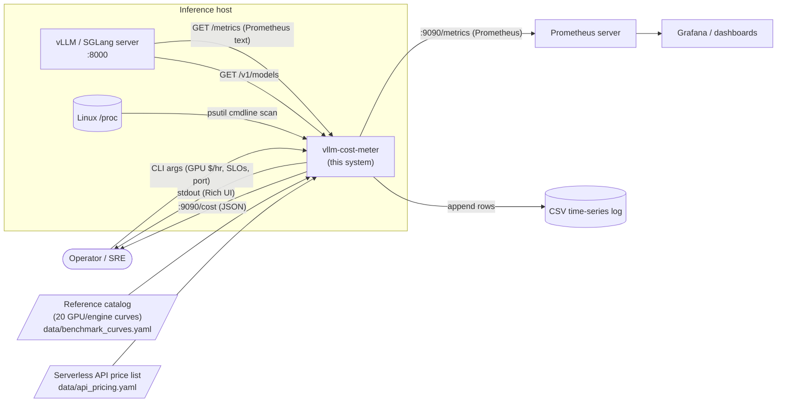

The meter is **non-invasive**: it never writes to the vLLM process, never modifies inference traffic, and never opens privileged file handles. It is a pure consumer of an existing `/metrics` surface.

---

## 3. Component Architecture

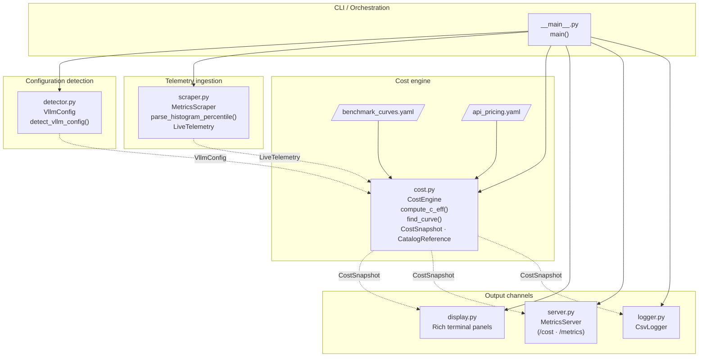

### Module responsibilities (one-liners)

| Module | Lines | Responsibility |
| --- | ---: | --- |
| `__main__.py` | 213 | Argument parsing, validation, scrape loop, signal handling |
| `detector.py` | 119 | 4-tier config resolution: override → `/proc` → API → defaults |
| `scraper.py` | 177 | Prometheus text parser, rolling-window rate derivation |
| `cost.py` | 156 | `C_eff` math, catalog lookup, API crossover, `CostSnapshot` |
| `display.py` | 115 | Rich panels (telemetry / catalog reference / SLO / API table) |
| `server.py` | 146 | Daemon-thread HTTP server (`/cost` JSON + `/metrics` Prom) |
| `logger.py` | 43 | 27-column CSV append-only logger |

---

## 4. Runtime Data Flow

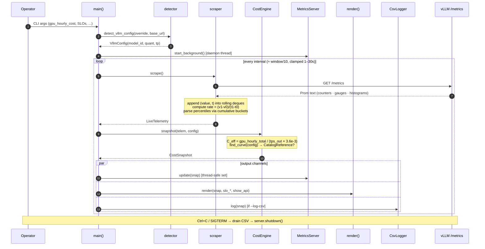

### Critical timing

- `interval = max(min(window_minutes * 60 / 10, 30), 1)` — clamped to **[1s, 30s]**.
- Default window of 5 min ⇒ 30 s interval (10 samples/window).
- Rolling window is enforced by trimming deques older than `window_seconds`.
- Rate computation is a **two-point delta** between the oldest retained sample and the newest — *not* a per-tick first-difference. This makes results robust to single-tick scrape blips.

---

## 5. Domain Model

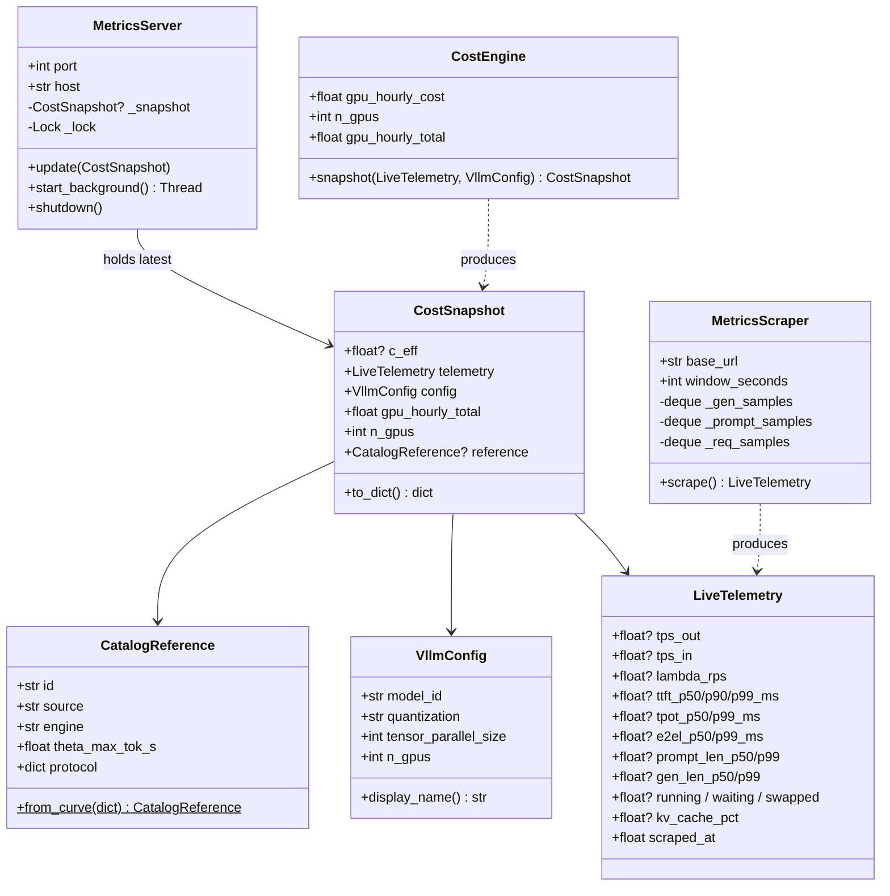

Every output type — JSON, Prometheus, CSV — is derived from a single immutable `CostSnapshot`. This keeps the three egress paths schematically aligned.

---

## 6. Configuration Detection (priority chain)

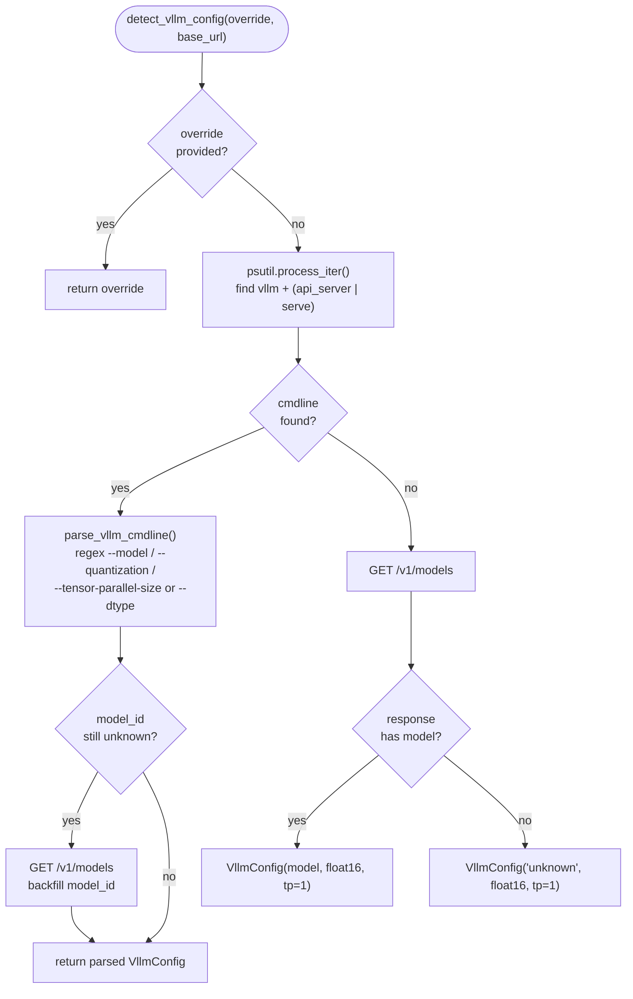

**Note:** quantization defaults to `float16` when the API path is used (the OpenAI-shaped `/v1/models` endpoint does not advertise dtype). This is a known precision loss and is documented in the source comments.

---

## 7. Prometheus Parsing Strategy

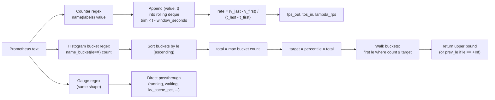

**Why no interpolation?** Prometheus `histogram_quantile` itself uses a conservative upper-bound for the highest bucket; the meter mirrors that semantics so users can cross-check meter output against `histogram_quantile()` in their Prometheus stack without surprise.

**Why two-point rate (not first-difference)?** With a 5-minute window and 30-second polls, transient tick-level noise (request batches landing in a single scrape) would produce wildly oscillating per-tick rates. The two-point method smooths naturally and matches operational intuition ("tokens per second over the last N minutes").

---

## 8. The `C_eff` Cost Formula

```text
C_eff [$/MTok] = gpu_hourly_total [$/hr]
                 ───────────────────────────────────
                 tps_out [tok/s] × 3600 [s/hr] / 1e6 [tok/MTok]
```

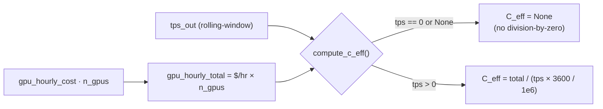

The denominator's intuition: `tps_out × 3600 / 1e6` = millions-of-tokens produced per hour. So `C_eff` is literally "dollars per million tokens at the *currently observed* throughput rate."

`C_eff` is **load-dependent**: at 1 RPS it can be 24–36× higher than at saturation. The meter exposes this honestly without claiming the difference is "waste" — that judgement requires the user's own SLO.

---

## 9. HTTP API Surface

| Endpoint | Method | Format | Purpose |
| --- | --- | --- | --- |
| `/cost` | GET | JSON | Latest snapshot as a flat dict (28 fields) |
| `/metrics` | GET | Prometheus 0.0.4 text | 15+ gauges with `model`/`quant`/`n_gpus` labels |
| anything else | GET | 404 | No catch-all, no listing |

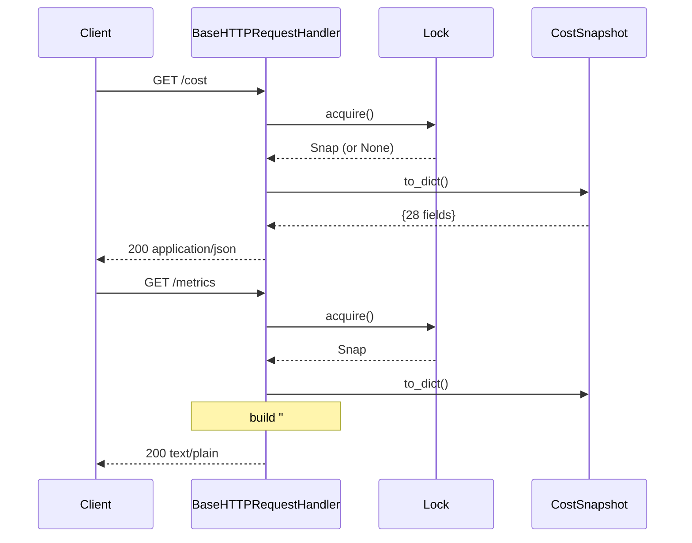

**Threading:** `MetricsServer._lock` guards the snapshot pointer. Snapshot objects are immutable dataclasses, so handlers can read fields after releasing the lock without races.

**Bind safety:** Default `127.0.0.1`. The CLI prints a warning when `--bind 0.0.0.0` is used. `allow_reuse_address = True` so restarts don't hit `EADDRINUSE`.

---

## 10. Outputs & Schemas

### 10.1 JSON snapshot (`/cost`)

Flat 28-key dict — see `CostSnapshot.to_dict()` (`cost.py:106-135`). Every numeric field is rounded for readability and may be `null` if not yet observed (e.g., before two scrapes have populated rolling deques).

### 10.2 Prometheus gauges (`/metrics`)

Naming convention: `llm_cost_meter_<metric>` with labels `model="..."`, `quant="..."`, `n_gpus="..."`. Examples:

- `llm_cost_meter_eff_cost_per_mtok` — primary cost gauge
- `llm_cost_meter_tps_observed` / `llm_cost_meter_tps_input`
- `llm_cost_meter_lambda_rps`
- `llm_cost_meter_ttft_p{50,90,99}_ms`, `llm_cost_meter_tpot_p{50,99}_ms`, `llm_cost_meter_e2el_p{50,99}_ms`
- `llm_cost_meter_batch_{running,waiting,swapped}`
- `llm_cost_meter_kv_cache_pct`

### 10.3 CSV log (one row per tick)

27 columns; header is auto-written when the file is empty. Schema is duplicated in `CsvLogger.COLUMNS` and `CostSnapshot.to_dict()` — the test `test_curves_schema.py` keeps them aligned with the catalog.

---

## 11. Reference Catalog

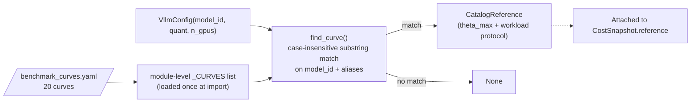

### Catalog inventory (20 curves)

| Hardware | Engine | Models | Configs |
| --- | --- | --- | --- |
| H100 | vLLM | Llama-3.1-8B, Qwen3-30B-A3B, Mixtral-8×7B | 6 (FP16 + FP8 each) |
| H100 | SGLang | same three models | 6 |
| A100 | vLLM | Llama-3.1-8B, Qwen3-30B-A3B, Mixtral-8×7B | 4 |
| A100 | SGLang | Llama-3.1-8B | 1 |
| A100 multi-GPU | mixed | Mixtral-8×7B at TP={2,4} | 3 |

Each curve carries a 9-key `workload_protocol` block: `input_tokens_mean`, `output_tokens_mean`, `input_distribution`, `arrival_pattern`, `burstiness`, `prefix_caching`, `chunked_prefill`, `sla_bound`, `source`. The catalog is therefore *self-describing* — a consumer can decide whether the protocol matches their own workload before trusting `theta_max`.

The meter only displays the reference; it never claims the user's deployment "should" hit `theta_max`.

---

## 12. Threading Model

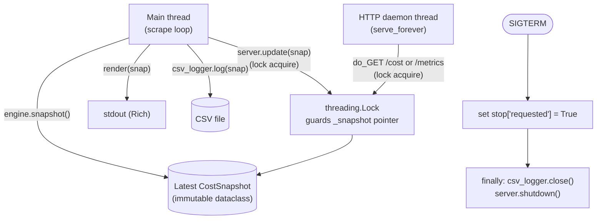

The HTTP server is bound on the main thread before `start_background()` returns its daemon thread, so callers (and tests) can read `_httpd.server_address` without racing the listener.

---

## 13. Testing Strategy

`tests/` contains 6 unit-test files, all `pytest`-driven:

| File | Subject | Coverage focus |
| --- | --- | --- |
| `test_scraper.py` | Prometheus parser | Counter/gauge/histogram regex, percentile lookup, rolling deque None-safety |
| `test_cost.py` | Cost math + catalog | `compute_c_eff` formula, zero-TPS handling, snapshot schema (no judgement fields), `find_curve` matching, API crossover |
| `test_detector.py` | Config detection | cmdline regex, fallback chain, `n_gpus` derivation, override priority |
| `test_server.py` | HTTP endpoints | Prometheus gauge schema, JSON schema, no-leak guarantees |
| `test_cli_flags.py` | CLI validation | Type checking, `--compare-api` SLO-mismatch gating |
| `test_curves_schema.py` | Catalog completeness | 20 curves present, 9 `workload_protocol` keys per curve |

Fixtures: `tests/fixtures/vllm_metrics_full.txt` is a captured Prometheus payload used by parser tests.

There are **no integration tests** that boot a real vLLM server. Given the read-only sidecar model, this is a reasonable scope; the parser is the primary risk surface and is well-fixtured.

---

## 14. Code-Review Observations

### 14.1 Strengths

| Area | Note |
| --- | --- |
| **Single source of truth** | All three egress channels derive from `CostSnapshot.to_dict()`. Schema drift is bounded to one method. |
| **Defensive numeric inputs** | `_positive_float`, `_positive_int`, `_port` argparse types reject NaN/inf and out-of-range ports before they reach business logic. |
| **Quantization allow-list** | `__main__.py:133` rejects `--quantization` outside `{float16, fp8, int8, int4}`. |
| **Bind default is loopback** | Aligned with v1.1 hardening; `0.0.0.0` triggers an explicit operator warning. |
| **Catalog separation from code** | YAML data files live in `vllm_cost_meter/data/` and are loaded via `importlib.resources` — packaging-correct, no path hacks. |
| **Conservative percentile semantics** | Matches Prometheus `histogram_quantile` upper-bound behavior — no invented precision. |
| **Clean dataclasses** | `LiveTelemetry`, `CostSnapshot`, `CatalogReference`, `VllmConfig` are flat, `Optional`-friendly, easy to serialize. |
| **Graceful shutdown** | SIGTERM handler ensures CSV is flushed before exit; suitable for systemd/k8s. |
| **Test-data alignment** | `test_curves_schema.py` enforces the 9-key `workload_protocol` contract on every curve. |

### 14.2 Minor concerns / opportunities

1. **`scraper.py` regex is permissive about labels.** `_BUCKET_RE_TEMPLATE` matches any `le="…"` — fine in practice for vLLM, but if a metric carried a different `le_quantile` style label this would mis-parse. *Severity: low* (Prometheus convention is well-defined).
2. **`MetricsScraper.scrape()` swallows nothing.** Network errors raise; the main loop catches `Exception` and prints a warning. The retry interval equals the scrape interval, which is fine but a single transient HTTP error gets logged once per cycle. *Severity: cosmetic.*
3. **Two-point rate for short windows.** With only two samples and a brief uptime, `_rate()` returns `None` until the second scrape. Operators may see `-` for `C_eff` for the first ~30 seconds. *Severity: documented behavior.*
4. **`find_curve()` substring matching.** `"llama" in "llama-3.1-8b"` will match a curve with `model_id` `meta-llama/Meta-Llama-3.1-8B-Instruct`, but it would also match an unrelated `LlamaGuard` model if alias hygiene slips. The catalog uses fairly specific aliases, but this is a sharp edge worth a future tightening (e.g., parameter-count-aware matching). *Severity: low.*
5. **`VllmConfig.n_gpus` is hardcoded to `tensor_parallel_size`.** Pipeline-parallel or expert-parallel deployments will under-count GPUs. The `--n-gpus` override is the workaround. *Severity: known limitation, documented via flag.*
6. **`logger.py` uses a single `flush()` per row.** Fine for low-frequency scrapes (≥1 s), but if someone configures sub-second scraping in the future, this would hammer the page cache. *Severity: not currently triggered.*
7. **`display.render()` calls `console.clear()` every tick.** Works on terminals; will spam non-TTY captures (e.g., journald). Most operational stacks already redirect stdout, so impact is low. *Severity: cosmetic.*
8. **`api_pricing.yaml` is a snapshot.** The file carries `last_verified` per entry, but stale prices are an inevitable risk. The `--accept-slo-mismatch` gate already discourages naïve comparisons; consider also surfacing the verification date in the dashboard table.
9. **No structured logging.** All operator output goes to Rich-formatted stdout. For production aggregation, a `--json-log` mode (NDJSON to stderr) would be a small lift.
10. **Error reporting from `CostEngine.snapshot`.** It cannot fail given current inputs, but if a future change adds I/O to the path, the main loop's `except Exception` would mask the trace context. Not a current bug.

### 14.3 Security posture

- **Read-only** with respect to the inference engine.
- **Loopback default** for the HTTP server (`127.0.0.1:9090`).
- **No authentication** on the HTTP endpoints — explicitly intended for trusted networks; documented.
- **No persistent state** apart from optional CSV.
- **Process scan** uses `psutil` with `NoSuchProcess`/`AccessDenied` guards — won't crash on locked-down hosts, but will silently fall back to the API path.
- **YAML loading** uses `yaml.safe_load` — no arbitrary object construction risk.
- **No shelling out** anywhere. `subprocess` is not imported.

---

## 15. Operational Concerns

### 15.1 Deployment topologies

```mermaid
flowchart LR
    subgraph node["Inference node"]
        v["vLLM :8000"]
        m["meter :9090<br/>(systemd or sidecar)"]
        v -. "/metrics" .-> m
    end
    p["Prometheus"] -- "scrape" --> m
    g["Grafana"] --> p
    cs[("CSV time-series")] <-- "append" --- m
```

Recommended: one meter per inference process (it auto-detects the local vLLM). For multi-instance hosts, run multiple meters on distinct ports.

### 15.2 Failure modes

| Scenario | Behavior |
| --- | --- |
| vLLM not yet up | Scrape raises; warning printed; loop continues. |
| `/v1/models` unreachable but `/proc` has cmdline | Cmdline parse succeeds; meter operates with possibly unknown quantization (defaults `float16`). |
| Counter resets (vLLM restart) | Two-point rate goes negative briefly until deque trims out the pre-restart sample. *Future work: drop samples on monotonicity violation.* |
| Clock skew | All timing uses `time.monotonic()` — immune to wall-clock jumps. |
| Catalog miss | `reference = None`; dashboard simply omits the reference panel. |
| CSV disk full | First failed `flush()` raises; main loop's `Exception` handler logs and continues — the CSV row is lost. |

### 15.3 Performance envelope

- One HTTP GET per scrape interval (`requests` library, 5-second timeout).
- Three regex passes over the metrics text (counters, gauges, histograms × ~13 names).
- Deque trimming is amortized O(1).
- Memory: deques bounded by `window_seconds / interval` ≈ 10 samples each.
- HTTP server is single-threaded `BaseHTTPRequestHandler` — fine for Prometheus's polling cadence; would not handle thousands of clients.

---

## 16. Dependencies

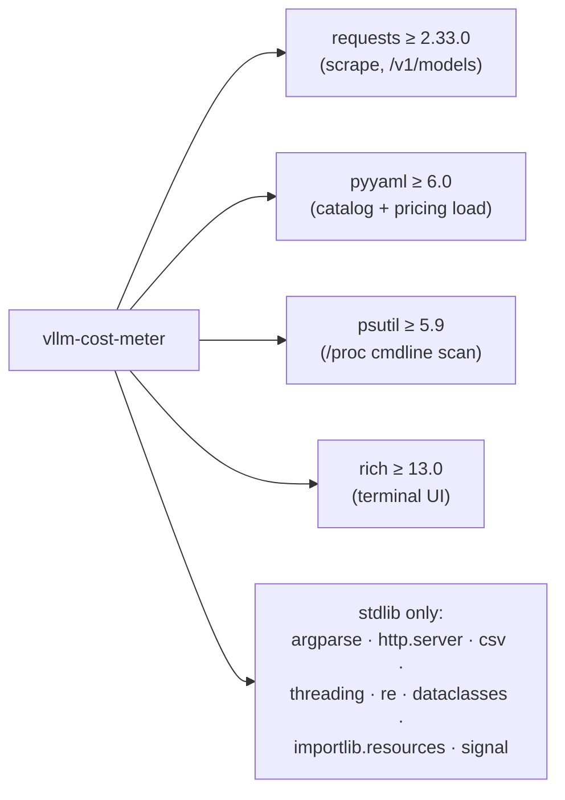

Total runtime closure is small (4 third-party libs, all widely deployed). Dev extra adds `pytest ≥ 8`.

---

## 17. Repository Layout

```text
vllm-cost-meter-public/
├── vllm_cost_meter/
│   ├── __init__.py            # version
│   ├── __main__.py            # CLI entry
│   ├── detector.py            # VllmConfig, detection chain
│   ├── scraper.py             # Prom parser, MetricsScraper, LiveTelemetry
│   ├── cost.py                # CostEngine, CostSnapshot, catalog
│   ├── display.py             # Rich panels
│   ├── server.py              # HTTP /cost + /metrics
│   ├── logger.py              # CSV logger
│   └── data/
│       ├── benchmark_curves.yaml   # 20 reference curves
│       └── api_pricing.yaml        # Serverless price list
├── tests/                          # pytest suite (6 files + fixtures)
├── simulation/
│   └── send_requests.py            # Phased load generator (1→5→10→25→50→1 rps)
├── data/                           # Frozen paper corpus (140 + 32 + 4 rows)
│   ├── master_results.csv
│   ├── master_results_v2.csv
│   └── c2_stability_cv.csv
├── pyproject.toml
├── README.md
├── CHANGELOG.md
└── LICENSE                         # MIT
```

The `data/` directory at the repo root holds the **raw paper corpus** that the bundled `vllm_cost_meter/data/benchmark_curves.yaml` is summarized from. This separation keeps the runtime catalog small (8.8 KB) while preserving full provenance for paper reviewers.

---

## 18. Design Rationale (FAQ)

**Why not derive `theta_max` automatically from observed traffic?**
Doing so would require running until saturation — invasive on a production server. The catalog provides a frozen reference; users can also derive their own via the simulation script.

**Why no "you are wasting X%" line item?**
Removed in v1.0. The "waste" calculation (1 − observed/saturation) presumes the user *wants* saturation, which is rarely true under SLO-bounded operation. Reporting it without the SLO context misleads more than it informs.

**Why a daemon HTTP server when one could shell out a Prometheus exporter library?**
Zero new dependency surface. `http.server` is in stdlib. The 15-gauge schema is small enough to format by hand without sacrificing safety.

**Why is the API comparison gated behind a flag with an explicit acknowledgement?**
Serverless APIs publish no production-grade SLO. A self-hosted dedicated deployment with a real SLO is mathematically comparable per token, but operationally not equivalent. The gate forces the operator to acknowledge this asymmetry before showing the comparison table.

---

## 19. Roadmap Indicators (from CHANGELOG / README)

- **v1.1 (current):** Public-mirror sanitization, A100 catalog expansion (8 new curves), input validation hardening, loopback-default bind.
- **Implied v2 directions:**
  - Goodput curves (throughput under explicit SLO bounds).
  - Workload-protocol-aware reference matching (not just `(model, quant, n_gpus)`).
  - First-class observation of scheduler-policy-induced cost variation.

---

## 20. Summary

`vllm-cost-meter` is a small, sharply-scoped Python package with strong design discipline: a single core formula, a single canonical snapshot, three coherent egress channels, and a transparent reference catalog. The code is well-tested at the unit level, defensive at I/O boundaries, and conservative about claims it doesn't have evidence for. The principal forward-looking work is on the *modeling* side (goodput, protocol-aware references) rather than the engineering scaffolding, which is fit for purpose.
